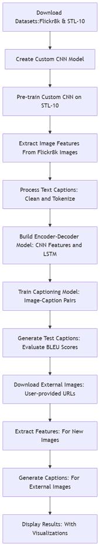

# Image Caption Generator with Custom CNN and LSTM

## Overview

This project implements an end-to-end image captioning system that combines a custom Convolutional Neural Network (CNN) for image feature extraction with Long Short-Term Memory (LSTM) networks for natural language generation. The CNN is pre-trained on the STL-10 dataset to learn robust visual features, then fine-tuned for captioning using the Flickr8k dataset. The system can generate descriptive captions for images and evaluate performance using BLEU scores.

## Features

- **Custom CNN Architecture**: Inspired by AlexNet with convolutional layers, batch normalization, and dropout for robust feature extraction
- **Pre-training Strategy**: Initial training on STL-10 dataset to learn general visual representations
- **Encoder-Decoder Model**: LSTM-based sequence generation for caption creation
- **Data Preprocessing**: Comprehensive text cleaning and tokenization for captions
- **Evaluation Metrics**: BLEU score calculation for quantitative assessment
- **External Image Support**: Capability to generate captions for user-provided images
- **Visualization**: Training history plots and model architecture diagrams

## Prerequisites

- Python 3.8+
- TensorFlow 2.15.0
- NumPy 1.25.2
- Pandas 2.0.3
- Matplotlib 3.7.1
- NLTK (for BLEU scores)
- PIL for image processing
- tqdm for progress bars

## Datasets

The project uses two main datasets:

1. **Flickr8k**: Contains 8,000 images with 5 captions each
   - Download: [Kaggle Flickr8k Dataset](https://www.kaggle.com/datasets/adityajn105/flickr8k)

2. **STL-10**: Used for pre-training the CNN model
   - Download: [Kaggle STL-10 Dataset](https://www.kaggle.com/datasets/jessicali9530/stl10)

## Installation and Setup

1. **Clone the repository**:
   ```bash
   git clone https://github.com/your-username/ImageCaptionGeneratorCustomCNNWithLSTM.git
   cd ImageCaptionGeneratorCustomCNNWithLSTM
   ```

2. **Install dependencies**:
   ```bash
   pip install -r requirements.txt
   ```

3. **Download datasets**:
   - Download Flickr8k and STL-10 from the provided Kaggle links
   - Extract to appropriate directories as shown in the notebook

4. **Run the notebook**:
   - Open `ImageCaptionGenerationCustomCNNModelWithLSTM.ipynb` in Jupyter or Google Colab
   - Execute cells sequentially to train the model and generate captions

## Project Workflow

Below is the workflow diagram:



## Model Architecture

### Custom CNN (Feature Extractor)
- Input: 96x96x3 images
- Convolutional layers with increasing filter sizes (96, 256, 384, 384, 256)
- Max pooling and batch normalization
- Fully connected layers (4096 units each)
- Output: 4096-dimensional feature vector

### Captioning Model (Encoder-Decoder)
- **Encoder**: Dense layer reducing image features to 256 dimensions
- **Decoder**: Embedding layer + LSTM (256 units) + Dense output
- Skip connection between image features and LSTM output
- Softmax output for vocabulary prediction

## Training Details

- **CNN Pre-training**: 20 epochs on STL-10 with early stopping and learning rate reduction
- **Captioning Model**: 10 epochs with batch size 16, trained on Flickr8k captions
- **Optimization**: Adam optimizer with default learning rate
- **Loss**: Categorical cross-entropy for sequence prediction


Training curves show convergence with reduced overfitting through dropout and early stopping.

## Acknowledgments

- Flickr8k dataset creators
- STL-10 dataset creators
- TensorFlow/Keras community
- Research papers on image captioning architectures
